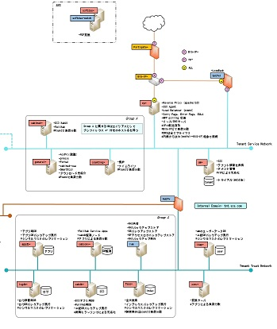
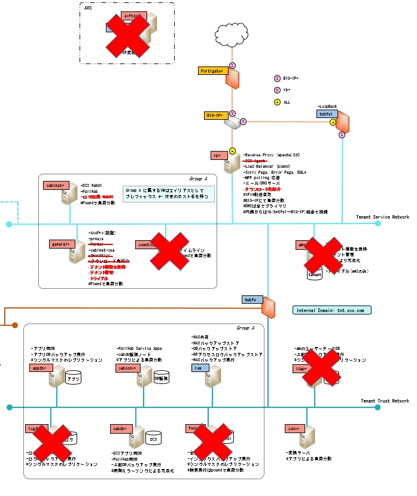

# 情報共有発表会
## SdOリニューアル概要について 
---

## 目次

* 経緯
* どのように変わるのか
* 移行スケジュール
---

## 経緯
1. 現在使用しているサーバー、日立SecureOnlineが老朽化。
    * 将来的にAWSへの引っ越しが必要。
1. ほとんど使われていない機能が乱立＆フレームワークの老朽化
    * ユーザビリティの低下や無駄なメンテナンスコストをなくしたい  
↓
1. AWS移行の前に、機能削減を行うことで予めサーバー台数を減らしたい。

---

## 基本方針
* 機能縮小（削除）することによる今後のメンテナンス費用削減
* 機能縮小することによるユーザビリティ向上

---

## 主な変更点（１）
### 機能削減
* ポータル
* AccoutantProfessionalOnline
    * 認証は機能として残るが、UIとしてはアクセス不可。
        * ユーザーの追加、削除、パスワード変更はDCOに移植
    * 集計機能は廃止
--
* どこプリ
* 全文検索
    * 検索はファイル名でのみ可能
* タイムライン
* ネットワークプリント連携
--
* 印刷機能
    * 複写機からの印刷のみ残る
* ログ収集機能
    * オペレータ用操作ログ収集機能として、DCOに移行
---
## 主な変更点（３）
### ログイン機能の簡略化
* 既存：`ログインページ→ポータル(SSO)→DCO`
* リニューアル後：`ログインページ→DCO`
---
## サーバー構成
### before
  

---
## サーバー構成
### after
  

---
移行スケジュール
* ３月メンテナンスでリニューアル版へ移行予定
* ５～６月頃目途にAWS環境へ移行予定
---
以上。